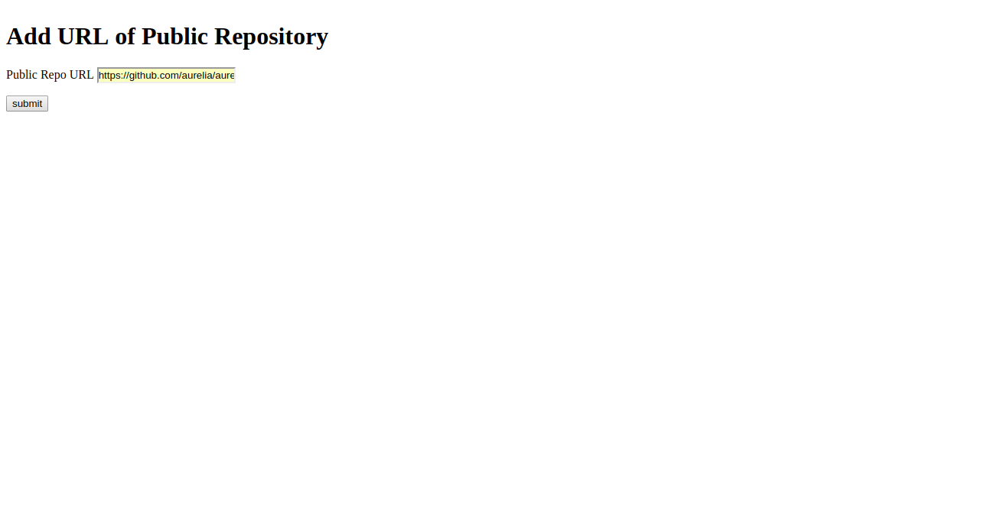

# GITOpenIssues
Purpose of this application is to show the number of open issues in a git repository given a public repo url based on the following criteria:
- Total number of Open Issues.
- Total number of Open ISsues in 24 hrs.
- Total number of Open Issues more than 24hrs upto 7 days.
- Total number of Open Issues more than 7 days.

The application is built upon Flask.

## Prerequisites
To install requirements: `pip install -r requirements.txt`

## Run the Application
- To run the application : `python3 pythoncode.py`
- Open your browser and type: `http://localhost:5000`

## Front-end
This is completely created using HTML. User can input any GIT Repository URL in the Public Repo URL textbox and click on submit button. It will take user to a dashboard that will display the above required information in a table.

Please refer the images below.
1. 
2. [Alt text](Screenshots/img2.png)

## Back-end
- The URL fetched from the first page i.e form.html is split to fetch the username and the name of repository.
- Requests module is used to make a GET request to the github repo api to fetch the total issues count i.e `open_issues_count` key.
- Since, issues were spread across multiple pages and were limited to only 30. Pagination is used to fetch total issues present in multiple pages by changing the default `per-page` parameter to 100.
- Again a GET request is made to issues api using the above obtained username, repo and page details.
- The response obtained is used to segregate the issues basis the timestamp values i.e `created_at` key.
- The final data is rendered to data.html. 
- Any error in the input url viz. invalid url, inaccessible url etc. will lead to error.html.
